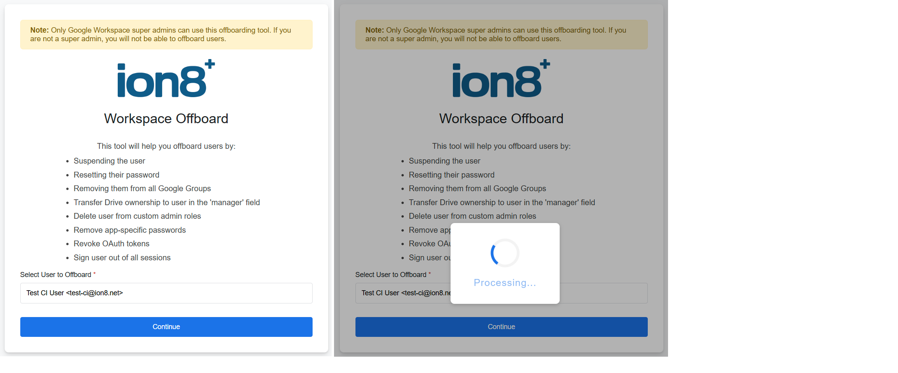

# Google Workspace User Offboarding Tool

A secure, automated offboarding solution for Google Workspace administrators built with Google Apps Script.

## Overview

This tool streamlines the user offboarding process by automating critical security and administrative tasks in a single click, ensuring no steps are missed when employees leave your organization.

<p align="center">
  
</p>

## Features

### 🔒 Security Actions
- **Suspend user account** - Immediately prevents access to all Google services
- **Reset password** - Generates a new random password
- **Revoke OAuth tokens** - Removes third-party app access
- **Remove app-specific passwords** - Clears all ASPs
- **Sign out all sessions** - Forces logout from all devices

### 📁 Data Management
- **Transfer Drive ownership** - Automatically transfers all files to user's manager
- **Remove from all Google Groups** - Cleans up group memberships
- **Remove custom admin roles** - Revokes any administrative privileges

### ✨ User Experience
- **User search with autocomplete** - Quickly find users by name or email
- **Detailed action logging** - See exactly what was done for each user
- **Success/error notifications** - Clear feedback on offboarding status
- **Modern Material Design UI** - Clean, professional interface

## Requirements

- Google Workspace account with **Super Admin** privileges
- Access to Google Apps Script
- Admin SDK Directory API enabled
- Admin SDK Reports API enabled (for session management)

## Installation

### Step 1: Create Google Apps Script Project

1. Go to [script.google.com](https://script.google.com)
2. Click **New Project**
3. Name it (e.g., "Workspace Offboarding")

### Step 2: Add the HTML File

1. In your Apps Script project, click **+** next to Files
2. Select **HTML**
3. Name it `offboard`
4. Copy the contents of `index.html` into this file
5. Do the same with 'main.gs' and 'appscript.json'

### Step 3: Configure for Your Organization

Update the following in the HTML file:

**Line 378**: Replace the logo URL
```html

```

### Step 4: Deploy as Web App

1. Click **Deploy** > **New deployment**
2. Select type: **Web app**
3. Configuration:
   - **Execute as**: Me
   - **Who has access**: Anyone within your organization
4. Click **Deploy**
5. Copy the web app URL

### Step 5: Enable Required APIs

1. In Apps Script editor, click **Services** (+)
2. Find and add **Admin SDK API**
3. Find and add **Admin Reports API**
4. Click **Add** for each


```

## Usage

### For Administrators

1. Navigate to the deployed web app URL
2. Start typing the user's name or email in the search box
3. Select the user from the autocomplete dropdown
4. Click **Continue** to begin offboarding
5. Review the detailed results showing all actions taken

### Offboarding Checklist

The tool automatically performs these actions:

- ✅ **Account Suspension** - User cannot access Google Workspace
- ✅ **Password Reset** - Prevents re-authentication
- ✅ **Group Removal** - Removes all group memberships
- ✅ **Drive Transfer** - Transfers file ownership to manager (if specified)
- ✅ **Admin Role Removal** - Revokes administrative privileges
- ✅ **ASP Removal** - Deletes app-specific passwords
- ✅ **Token Revocation** - Removes OAuth authorizations
- ✅ **Session Logout** - Signs out all active sessions

## Important Notes

### Drive Transfer
- Drive transfer is **asynchronous** and may take several hours to complete
- To enable Drive transfer, you must provide a manager email
- You can modify the UI to add a manager selection field (similar to the onboarding tool)

### Data Retention
- This tool **suspends** users but does not delete them
- Suspended users still count toward your license count
- To fully delete a user, use the Google Admin Console after the retention period

### Audit Trail
- All actions are logged in the Apps Script execution logs
- The success modal shows a detailed breakdown of all actions taken
- Keep records of offboarded users for compliance purposes

## Troubleshooting

### "Only super admins can use this tool"
- Ensure you're logged in with a Super Admin account
- Verify Admin SDK APIs are enabled in your project

### "Failed to fetch users"
- Check that Admin SDK API is properly enabled
- Verify your script has the necessary OAuth scopes
- Try re-deploying the web app

### Drive transfer not working
- Ensure the manager email is valid and active
- Verify you have Admin SDK Directory API enabled
- Drive transfers can take hours - check Admin Console > Account > Data migration

### Some actions show "FAILED"
- Review the detailed log in the success modal
- Common causes: user already suspended, insufficient permissions, API limits
- Check Apps Script execution logs for detailed error messages

## Security Considerations

- ✅ **Super Admin Only** - Only super administrators can access this tool
- ✅ **Immediate Suspension** - Users are suspended before other actions
- ✅ **Password Reset** - Prevents re-authentication attempts
- ✅ **Session Revocation** - Forces logout from all devices
- ✅ **Token Cleanup** - Removes third-party app access
- ⚠️ **Audit Logging** - All actions are logged for compliance

## Customization

### Adding Manager Selection

To add a manager field for Drive transfer:

1. Add a manager autocomplete field to the HTML (similar to the onboarding tool)
2. Update the form submission to include `manager: managerEmail.value`
3. The backend already supports the manager parameter

### Modifying Offboarding Actions

To add or remove offboarding steps:

1. Edit the `offboardUser()` function in your backend script
2. Follow the existing pattern for error handling and logging
3. Each action should add an entry to the `log` array

### Custom Notifications

To send email notifications after offboarding:

```javascript
// Add to the end of offboardUser() function
MailApp.sendEmail({
  to: 'hr@yourdomain.com',
  subject: 'User Offboarded: ' + userEmail,
  body: 'User has been offboarded. See attached log.'
});
```

## Best Practices

1. **Test First** - Test the tool with a dummy user account
2. **Document Process** - Keep records of who was offboarded and when
3. **Review Logs** - Check the detailed logs after each offboarding
4. **Transfer Data** - Always specify a manager for Drive transfer
5. **Communicate** - Inform relevant teams before offboarding
6. **Follow Policy** - Ensure offboarding aligns with company policies

## Related Tools

- **Onboarding Tool** - Companion tool for creating new users
- **Google Admin Console** - For manual offboarding and verification
- **Data Transfer Service** - For managing Drive ownership transfers

## Support

For issues or questions:
- Check [Google Apps Script documentation](https://developers.google.com/apps-script)
- Review [Admin SDK documentation](https://developers.google.com/admin-sdk)
- Consult [Google Workspace Admin Help](https://support.google.com/a)

## License

MIT License - Feel free to modify and use for your organization.

## Changelog

### Version 2.0
- Initial release of offboarding tool
- Automated suspension, password reset, and group removal
- Drive transfer to manager
- OAuth token and ASP removal
- Session logout functionality
- Detailed action logging

---

**⚠️ Important**: Always test offboarding procedures with test accounts before using in production. Ensure you have proper backups and data retention policies in place.
